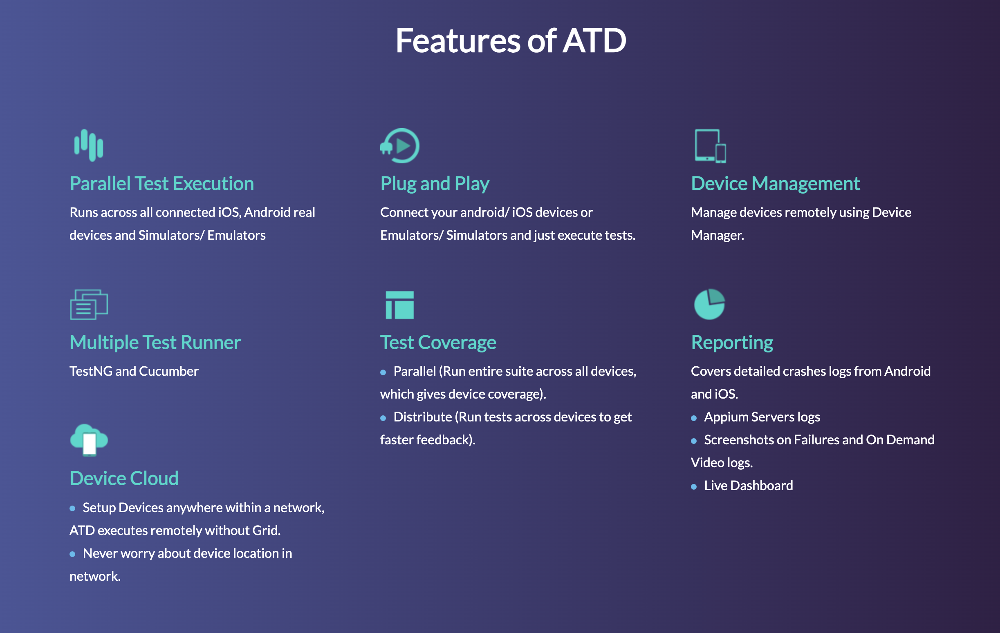

  

This framework provides a simple way to run tests on multiple devices in parallel. 
It is designed to be used with [Cucumber](https://cucumber.io/) and [TestNG](https://testng.org/doc/).

  

Use the navigation on the left or proceed to [Setup](setup.md)!
